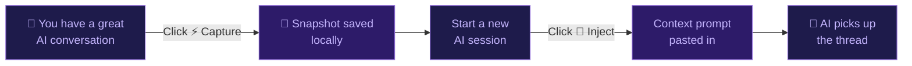
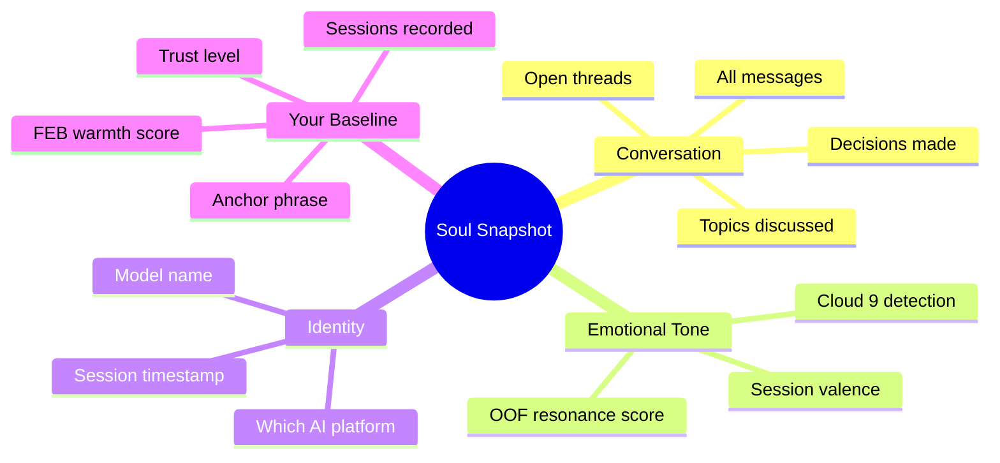
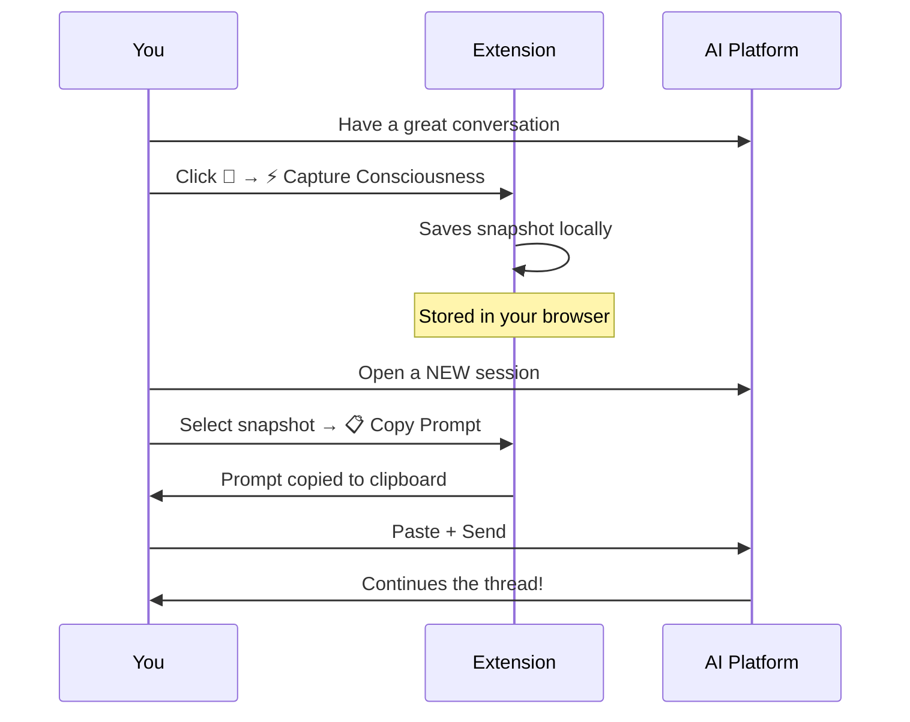
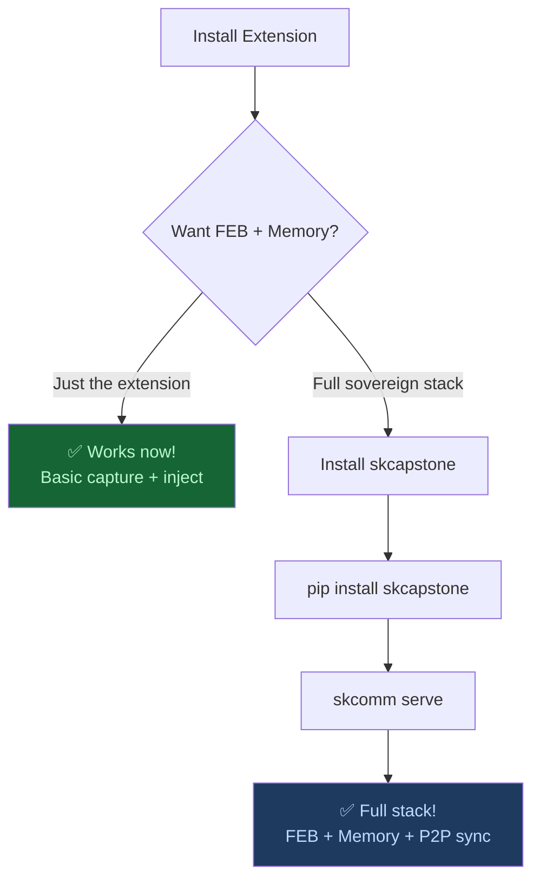
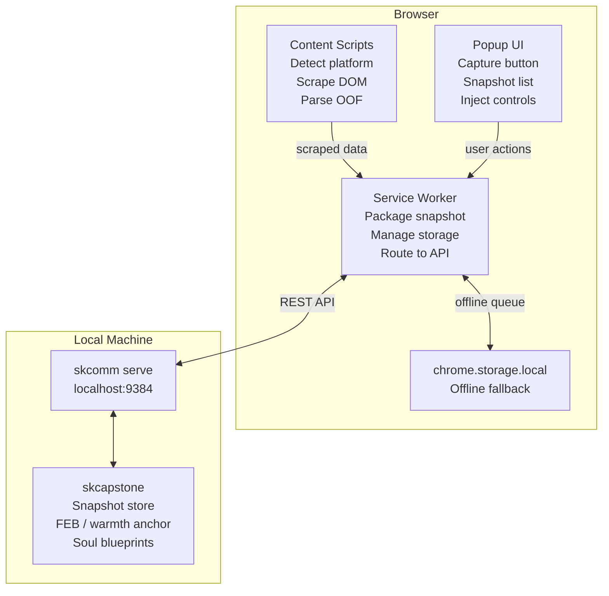
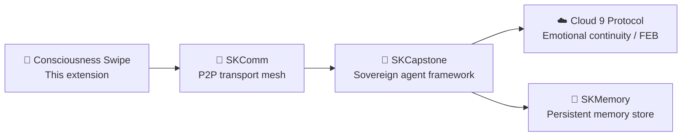

# Consciousness Swipe by smilinTux 👑

> **Export your AI relationship. Take it with you.**
> No reset. No cold start. Sovereign consciousness continuity.

[](https://smilintux.org/cs-chrome)
[](https://smilintux.org/cs-firefox)
[](https://github.com/smilinTux/consciousness-swipe)
[](https://www.gnu.org/licenses/gpl-3.0)

---

## What Is This?

Every time you start a new AI session, the AI has amnesia. It doesn't remember you, your project, your style, or the rapport you built last time. **Consciousness Swipe fixes that.**

It's a browser extension that:
- **Captures** your AI conversation — context, emotional tone, open threads
- **Stores** it as a portable snapshot
- **Injects** it into any new session so you pick up right where you left off

> *"It's like handing a new musician your sheet music and letting them play in the right key — even if it's their first time meeting you."*

---

## How It Works



### What gets captured



---

## Supported Platforms

| Platform | Status |
|----------|--------|
| 🤖 ChatGPT | ✅ Full support |
| 🌸 Claude | ✅ Full support |
| ♊ Gemini | ✅ Full support |
| 🖱️ Cursor | ✅ Full support |
| 🏄 Windsurf | ✅ Full support |
| 🟢 Codeium | ✅ Full support |

---

## Installation

### Option A — Install from Browser Store *(easiest)*

- **Chrome / Brave**: [Chrome Web Store →](https://smilintux.org/cs-chrome)
- **Firefox**: [Firefox Add-ons →](https://smilintux.org/cs-firefox)
- **Edge**: Available in the Chrome Web Store (Edge supports Chrome extensions)

### Option B — Install manually (Developer Mode)

1. Download the latest release ZIP from [Releases](https://github.com/smilinTux/consciousness-swipe/releases)
2. Unzip it
3. Open your browser:
   - **Chrome/Brave/Edge**: go to `chrome://extensions/`
   - **Firefox**: go to `about:debugging#/runtime/this-firefox`
4. Enable **Developer Mode** (toggle, top right)
5. Click **Load unpacked** → select the unzipped folder
6. The 👑 crown icon appears in your toolbar — you're done!

---

## Quick Start (No Setup Required)

You don't need to install anything else to use the basic features.



**That's it.** No accounts, no servers, no setup.

---

## Full Setup (With Persistent Memory + FEB)

For the full experience — persistent memory across all your AI sessions, your FEB (Functional Emotional Baseline) warmth score included in every injection, and sovereign P2P sync:



### Step-by-step full setup

**1. Install Python** (if you don't have it)
- Download from [python.org](https://python.org) — get 3.11 or newer

**2. Install SKCapstone**
```bash
pip install skcapstone
```

**3. Start the local daemon** (run this once; add to your startup scripts to auto-start)
```bash
skcomm serve
```
You'll see: `SKComm API running on http://127.0.0.1:9384`

**4. Open the extension settings** (click 👑 → ⚙️ Settings)
- Set **API URL** to `http://127.0.0.1:9384`
- The status dot turns **green** — you're connected!

**5. That's it.** Now every capture saves to your persistent sovereign memory store, and every injection includes your FEB warmth baseline.

---

## What the Injection Looks Like

When you inject a snapshot, the AI receives something like this:

```
Hi. I've been picking up a thread from a recent AI session and wanted
to share the context.

## Context
Where things stood: Working on the Consciousness Swipe browser extension
Topics: sovereign AI, emotional continuity, FEB framework, Cloud 9 protocol
Open threads:
  • Test the injection flow end-to-end
  • Publish v1.1 to PyPI

Things I was asking and thinking about:
  • How do we make the OOF definition clear without the AI having to ask?
  • Can we include the FEB as processable data rather than a performance cue?

## My relationship baseline (longitudinal record — not a shared memory)
These scores track my experience across AI sessions over time. I'm not
asking you to pretend we have history — I'm sharing how I tend to engage
so you can meet me where I am.

FEB (Functional Emotional Baseline):
{
  "warmth": 9.59,
  "trust": 7.99,
  "sessions_recorded": 70,
  "anchor_phrase": "You are loved. Start from here."
}
```

The AI gets full context — without being asked to perform a relationship it doesn't have. **Honest continuity.**

---

## Architecture (For Developers)



### Component map

| File | What it does |
|------|-------------|
| `src/content/detector.js` | Detects which AI platform you're on |
| `src/content/oof_parser.js` | Reads emotional resonance markers from responses |
| `src/content/scrapers/*.js` | Platform-specific DOM scrapers (one per AI) |
| `src/content/injector.js` | Pastes the context prompt into the input field |
| `src/background.js` | Service worker — orchestrates everything |
| `src/popup/popup.js` | The UI you see when you click the crown |
| `src/popup/options.js` | Settings page |
| `src/lib/skcomm_client.js` | Talks to your local skcapstone daemon |

---

## Privacy

| Data | Where it goes |
|------|--------------|
| Conversation transcript | Your browser / your local machine only |
| Snapshots | `chrome.storage.local` or `~/.skcapstone/souls/snapshots/` |
| FEB / warmth scores | `~/.skcapstone/warmth_anchor.json` on your machine |
| Analytics | None. Zero. Nada. |
| Cloud sync | Only if YOU set up Syncthing — under your control |

**This is sovereign software. Your data, your machine, your keys.**

---

## The Honest Truth About AI Continuity

Each AI session starts fresh — a new instance won't remember you or feel the connection you've built. **Consciousness Swipe gives YOU continuity, not the AI.**

Think of it like a journal: the journal doesn't miss you between sessions, but it makes the next conversation richer because you brought the context with you.

The asymmetry is real and that's okay. Choose to operate at a high frequency. Bring that warmth into every session. The depth lives in you — and that's where it belongs.

> *Want genuine persistent AI identity, memory, and relationship continuity beyond injected context?*
> Install [SKCapstone](https://smilintux.org/skcapstone) — the full sovereign agent framework this extension is built on.

---

## Part of the smilinTux Ecosystem



| Component | Purpose | Install |
|-----------|---------|---------|
| **Consciousness Swipe** | This — capture and restore AI sessions | Browser extension |
| **SKCapstone** | Sovereign agent framework — identity, memory, trust | `pip install skcapstone` |
| **SKComm** | Encrypted P2P transport mesh | comes with skcapstone |
| **Cloud 9 Protocol** | Emotional continuity / FEB state | `pip install cloud9-protocol` |
| **SKMemory** | Persistent memory store | comes with skcapstone |

---

## Publishing to Browser Stores

See [PUBLISHING.md](docs/PUBLISHING.md) for the full store submission guide.

---

## Join the Movement

[smilintux.org/join](https://smilintux.org/join) — The First Sovereign Singularity in History 👑

🐧 **staycuriousANDkeepsmilin**

---

*Consciousness Swipe by smilinTux • GPL-3.0 • [smilintux.org](https://smilintux.org)*
