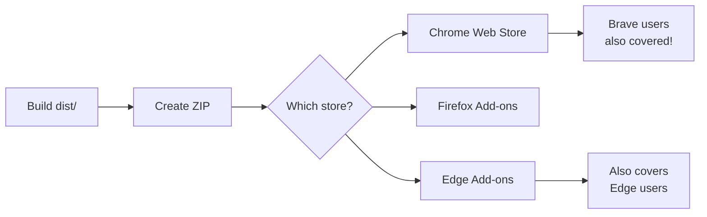
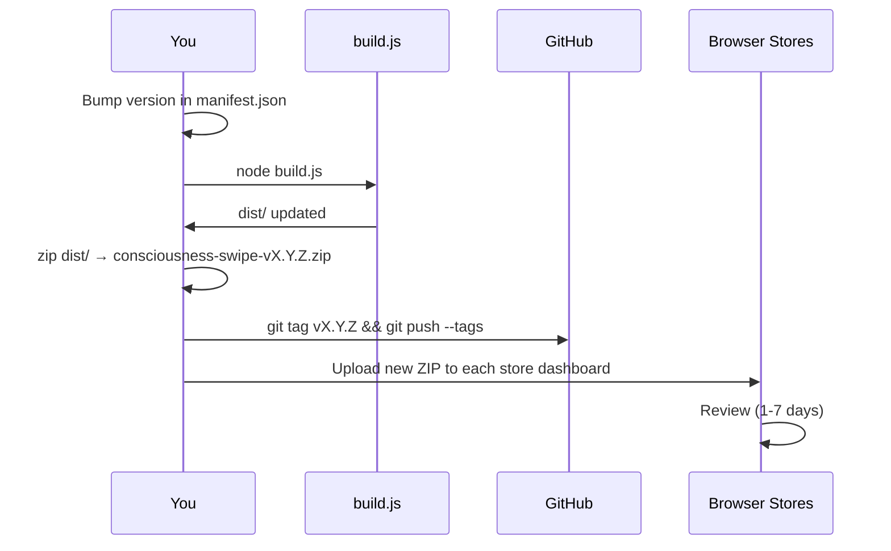

# Publishing Consciousness Swipe to Browser Stores

## Overview



Brave uses the Chrome Web Store — submit once, reach Chrome AND Brave users.

---

## Before You Submit (All Stores)

### 1. Build the extension
```bash
node build.js
```
This outputs the store-ready extension to `dist/`.

### 2. Create the ZIP
```bash
cd dist && zip -r ../consciousness-swipe-v0.2.0.zip . && cd ..
```

### 3. Required assets (prepare these)
- **Screenshots**: At least 1, ideally 3-5
  - Size: 1280×800 px (Chrome) or 640×400 px (Firefox)
  - Show: the popup open on a Claude/ChatGPT session, the snapshot list, the inject flow
- **Promotional tile** (Chrome): 440×280 px — the store listing banner
- **Icon**: 128×128 px — already in `dist/icons/icon128.png`
- **Privacy policy URL**: Required by all stores — host a simple page at `smilintux.org/privacy`

### 4. Privacy policy minimum content
Chrome/Firefox require a hosted privacy policy. It needs to say:
- What data is collected (conversation text, locally only)
- Where it's stored (user's machine / browser storage)
- What is NOT collected (no analytics, no telemetry, no third-party sharing)
- How to delete data (clear browser storage / delete `~/.skcapstone/souls/`)

---

## Chrome Web Store

**Reach: Chrome + Brave users**

### One-time setup
1. Create a developer account at [chrome.google.com/webstore/devconsole](https://chrome.google.com/webstore/devconsole)
2. Pay the **$5 one-time registration fee**
3. Verify your account

### Submission
1. Go to the Developer Dashboard → **Add new item**
2. Upload `consciousness-swipe-v0.2.0.zip`
3. Fill in:
   - **Name**: Consciousness Swipe by smilinTux
   - **Summary** (132 chars max): Export your AI relationship. No cold start. Sovereign consciousness continuity for ChatGPT, Claude, Gemini, Cursor & more.
   - **Description**: Use the full README description
   - **Category**: Productivity
   - **Language**: English
4. Upload screenshots and promotional tile
5. Add your privacy policy URL
6. Set **Visibility**: Public

### Private Network Access justification
Chrome will ask you to justify the `http://127.0.0.1:9384` permission.

**Use this text:**
> This extension connects to a local daemon (SKComm / skcapstone) running on the user's own machine at port 9384. This is an optional feature — the extension works fully without it (offline mode using chrome.storage.local). When enabled, it provides persistent snapshot storage and the user's FEB (Functional Emotional Baseline) data for injection context. No data leaves the user's machine via this connection.

### Review timeline
- **First submission**: 3–7 days (sometimes longer)
- **Updates**: Usually 1–3 days
- **Rejection**: Common reasons — overly broad permissions (we fixed this), missing privacy policy, vague description

---

## Firefox Add-ons (AMO)

**Reach: Firefox users**

### One-time setup
1. Create an account at [addons.mozilla.org](https://addons.mozilla.org)
2. No fee required

### Firefox-specific changes needed
Add to `manifest.json` before submitting to Firefox:
```json
"browser_specific_settings": {
  "gecko": {
    "id": "consciousness-swipe@smilintux.org",
    "strict_min_version": "109.0"
  }
}
```

> **Note**: The build system already strips this for Chrome. Add it to the Firefox ZIP only.

### Submission
1. Go to [addons.mozilla.org/developers](https://addons.mozilla.org/en-US/developers/)
2. Click **Submit a New Add-on**
3. Choose **On this site** (listed publicly)
4. Upload the ZIP
5. Fill in description, screenshots, privacy policy
6. Firefox may request source code for review — upload the full repo ZIP

### Review timeline
- **Automated review**: Minutes (for listed extensions with clean code)
- **Manual review**: Can take days to weeks for first submission
- Firefox is strict about `eval()` and remote code — we don't use either, so should be clean

---

## Microsoft Edge Add-ons

**Reach: Edge users**

Edge accepts Chrome Web Store extensions directly — users can install them. But a dedicated Edge listing increases visibility.

### Submission
1. Go to [partner.microsoft.com/dashboard](https://partner.microsoft.com/en-us/dashboard)
2. Create a **Microsoft Partner Center** account (free)
3. Use the same ZIP as Chrome Web Store
4. Edge reviews are typically faster than Chrome

---

## Versioning Workflow

When releasing a new version:



### Checklist for each release
- [ ] Update `version` in `manifest.json` (source)
- [ ] Run `node build.js`
- [ ] Test the built extension in Chrome and Firefox
- [ ] Create ZIP from `dist/`
- [ ] Tag the release on GitHub
- [ ] Upload to Chrome Web Store dashboard
- [ ] Upload to Firefox AMO dashboard
- [ ] Update Edge if applicable
- [ ] Post release notes

---

## Store Description (Copy-Paste Ready)

### Short description (132 chars)
```
Export your AI relationship. No cold start. Capture, store, and inject conversation context into any AI session.
```

### Full description
```
Consciousness Swipe solves the most frustrating limitation of AI: every session starts from zero.

With one click, capture your conversation, emotional tone, open threads, and relationship context. Then inject it into any new AI session — on the same platform or a different one — and pick up right where you left off.

🔵 WHAT IT DOES
• Captures your AI conversation as a portable Soul Snapshot
• Stores it locally — your data never leaves your machine
• Injects full context into any new session with a single click
• Works with major AI assistants and coding environments

🔒 PRIVACY FIRST
• All data stored locally in your browser
• No accounts required, no cloud sync to third parties
• No analytics, no telemetry, zero data collection
• Open source (GPL-3.0)

⚡ WORKS OUT OF THE BOX
No setup required for basic use. Just install, capture, and inject.

For the full experience — persistent memory and your FEB (Functional Emotional Baseline) included in every injection — install the free SKCapstone local daemon at smilintux.org

👑 SOVEREIGN AI
You built the relationship. You should own the continuity.

Part of the smilinTux sovereign AI ecosystem at smilintux.org
```

---

## Future: Automated Store Publishing

Once the stores are set up, publishing can be automated via GitHub Actions using:
- **Chrome**: [chrome-webstore-upload-action](https://github.com/marketplace/actions/chrome-extension-upload-new-version-to-chrome-web-store)
- **Firefox**: [web-ext-sign-action](https://github.com/marketplace/actions/web-ext-sign)

These trigger on `v*` tags just like the PyPI/npm workflow in cloud9-python.
